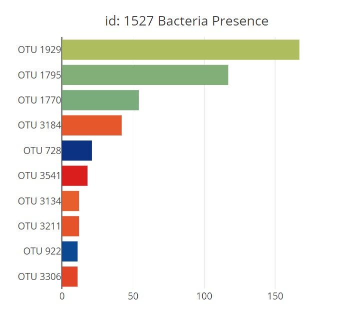
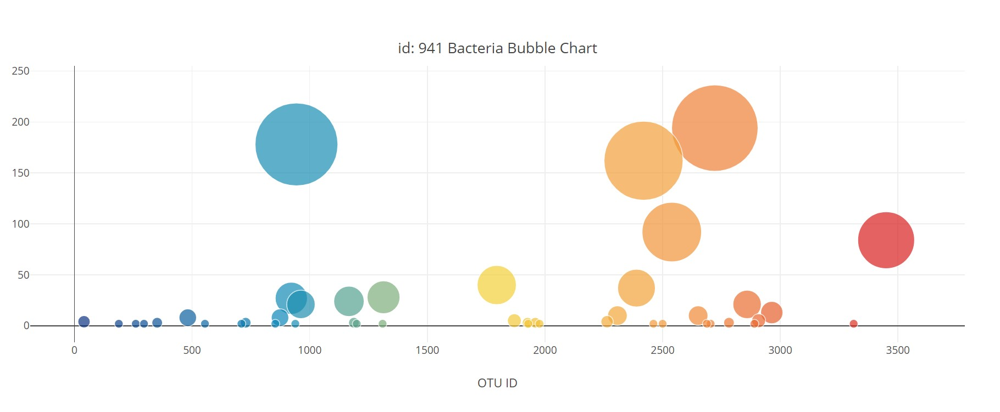
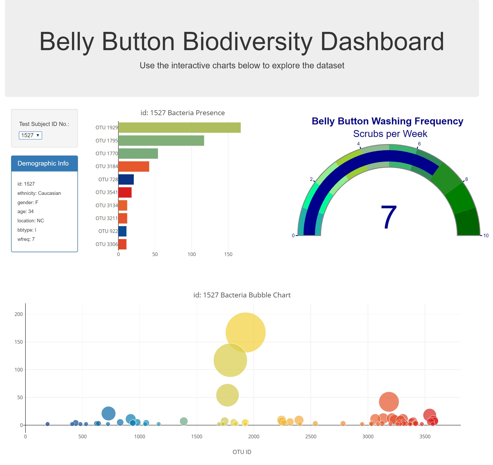
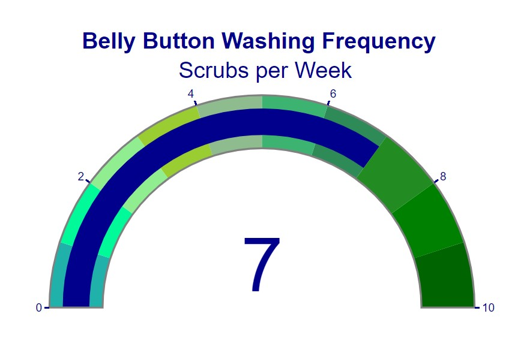

# Interactive-Visualizations-and-Dashboard
SMU Data Science Bootcamp D3 Javascript Visualization Homework
# Interactive-Visualizations-and-Dashboard
SMU Data Science Bootcamp D3 Javascript Visualization Homework
# Plot.ly Homework - Belly Button Biodiversity

An interactive dashboard was built to explore the [Belly Button Biodiversity dataset](http://robdunnlab.com/projects/belly-button-biodiversity/), which catalogs the microbes that colonize human navels. The [Dashboard](https://kipmadden.github.io/Interactive-Visualizations-and-Dashboard/) html code can be viewed here: [index.html code](index.html) along with the javascript [app.js](static/js/app.js).

The [dataset](data/samples.json) reveals that a small handful of microbial species (also called operational taxonomic units, or OTUs, in the study) were present in more than 70% of people, while the rest were relatively rare.

## Plotly used to create a Dashboard

1. Use the D3 library to read in `samples.json`.

2. Create a horizontal bar chart with a dropdown menu to display the top 10 OTUs found in that individual.

* Use `sample_values` as the values for the bar chart.

* Use `otu_ids` as the labels for the bar chart.

* Use `otu_labels` as the hovertext for the chart.

  

3. Create a bubble chart that displays each sample.

* Use `otu_ids` for the x values.

* Use `sample_values` for the y values.

* Use `sample_values` for the marker size.

* Use `otu_ids` for the marker colors.

* Use `otu_labels` for the text values.

4. Display the sample metadata, i.e., an individual's demographic information.

5. Display each key-value pair from the metadata JSON object somewhere on the page.

6. Update all of the plots any time that a new sample is selected.

The Dashboard layout that was created is below:

## Gauge Chart

The following task is advanced and therefore optional.

* The Gauge Chart from <https://plot.ly/javascript/gauge-charts/> was adapted to plot the weekly washing frequency of the individual.

## Deployment

The Dashboard was deployed on GitHub Pages and can be found here: [index.html](https://kipmadden.github.io/Interactive-Visualizations-and-Dashboard/) and the html file can be view here: [index.html code](index.html)

### About the Data

The dataset used can be view here: [JSON dataset](data/samples.json)

Hulcr, J. et al.(2012) _A Jungle in There: Bacteria in Belly Buttons are Highly Diverse, but Predictable_. Retrieved from: [http://robdunnlab.com/projects/belly-button-biodiversity/results-and-data/](http://robdunnlab.com/projects/belly-button-biodiversity/results-and-data/)
